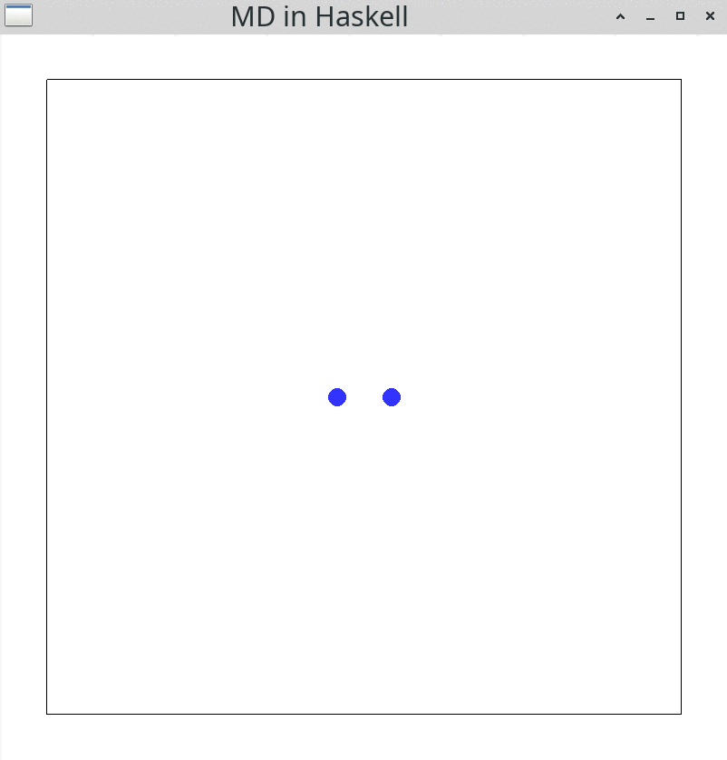

# Molecular Dynamics in Haskell

This is a Haskell implementation of the Verlet-Velocity algorithm in a molecular dynamics
framework.
See the [this]() blog post for more information (not published yet).

## Install

```bash
stack install
```

## Run examples

Change the `main` function in `src/Main.hs` according to the following section names
and run the example via:

```bash
stack run
```

### `mainNewton`

```haskell
main :: IO ()
main = mainNewton
```


### `mainNewtonBounce`

```haskell
main :: IO ()
main = mainNewtonBounce
```


### `mainVerlet1`

```haskell
main :: IO ()
main = mainVerlet1
```



## Documentation

Have a look at [the docs](./docs/Main.html) for the API documentation.

### Generate the docs

Generate the Haddock documentation with:

```bash
stack exec -- haddock --html src/Main.hs --hyperlinked-source --odir=docs
```

