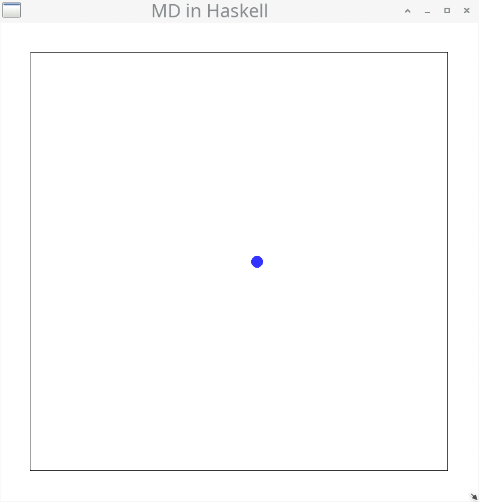
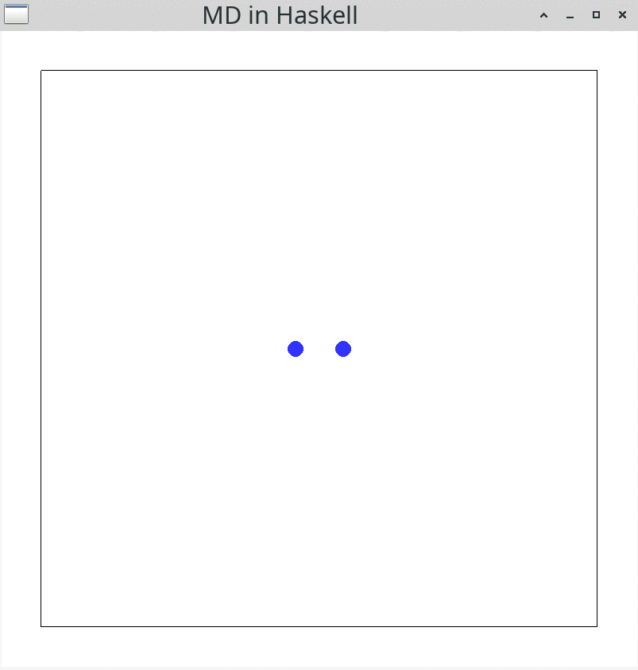
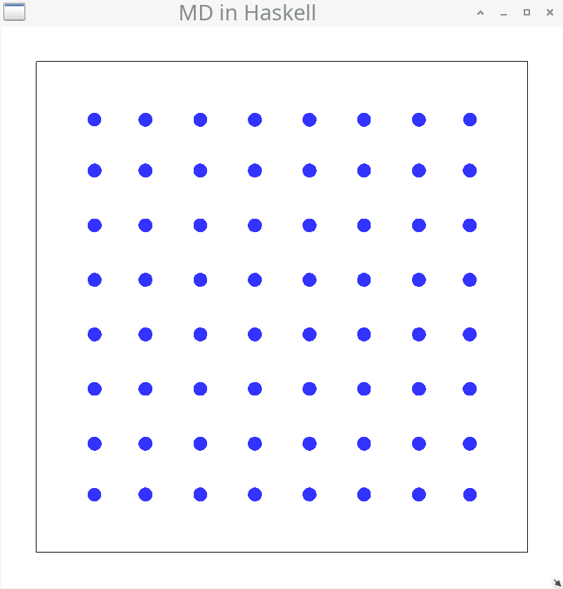

# Molecular Dynamics in Haskell

This is a Haskell implementation of the Verlet-Velocity algorithm in a molecular dynamics
framework for my [blog
post](https://mkdoku.github.io/posts/2021-06-19-molecular-dynamics.html).

## Pre-requisite Installations

Use  Ghcup  to install GHC, cabal-install, Stack and haskell-language-server from [here](https://www.haskell.org/ghcup/)

Additional Installation for Windows:

- Download the freeglut windows development libraries from [here](https://www.transmissionzero.co.uk/software/freeglut-devel/)
- Add freeglut/bin/x64/ to your executable path.   


## To Install Molecular Dyanmics

```bash
cd <path-to-MolecularDynamics-folder>
```

```bash
stack install
```

## Run examples

Change the `main` function in `src/Main.hs` according to the following section names
and run the example via:

```bash
stack run
```

### `mainNewton`

```haskell
main :: IO ()
main = mainNewton
```


### `mainNewtonBounce`

```haskell
main :: IO ()
main = mainNewtonBounce
```



### `mainVerlet`

```haskell
main :: IO ()
main = mainVerlet
```



### `mainVerletSquare`

```haskell
main :: IO ()
main = mainVerletSquare
```



### `mainVerletRandom`

```haskell
main :: IO ()
main = mainVerletRandom
```


## Documentation

Have a look at [the docs](./docs/Main.html) for the API documentation.

### Generate the docs

Generate the Haddock documentation with:

```bash
stack exec -- haddock --html src/Main.hs --hyperlinked-source --odir=docs
```

